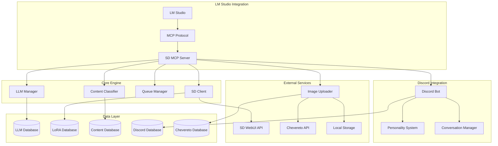

# SD MCP Server Architecture 🏗️

## Overview

The SD MCP Server is a comprehensive system that bridges **LM Studio**, **Stable Diffusion WebUI**, and **Discord** through the **Model Context Protocol (MCP)**. It provides intelligent image generation, conversation management, and content moderation capabilities.

## 🎯 Core Components



## 🔄 Data Flow Architecture

### 1. **LM Studio → Image Generation**
```
LM Studio Request → MCP Server → Content Analysis → Prompt Enhancement → 
SD WebUI Generation → Content Filtering → Image Upload → Response to LM Studio
```

### 2. **Discord Chat Workflow**
```
Discord Message → Personality Detection → LLM Processing → 
[Optional: Image Generation Trigger] → Response with Personality
```

### 3. **Image Upload Pipeline**
```
Generated Image → NSFW Detection → 
[Chevereto Upload OR Local Storage] → URL Generation → User Response
```

## 🧩 Module Architecture

### **`modules/llm/`** - LLM Provider System
- **`base_provider.py`** - Abstract LLM provider interface
- **`lmstudio_provider.py`** - LM Studio integration (primary)
- **`openai_provider.py`** - OpenAI API support
- **`claude_provider.py`** - Anthropic Claude support
- **`gemini_provider.py`** - Google Gemini support
- **`llm_manager.py`** - Provider orchestration
- **`discord_conversation.py`** - Discord-specific conversation handling
- **`llm_database.py`** - Conversation storage & personality management

### **`modules/stable_diffusion/`** - SD Integration
- **`sd_client.py`** - Core SD WebUI API client
- **`content_db.py`** - 161-category content classification
- **`lora_manager.py`** - LoRA intelligence system
- **`queue_manager.py`** - Generation queue management
- **`uploader.py`** - Multi-destination image upload
- **`chevereto_client.py`** - Chevereto API integration
- **`discord_integration.py`** - Discord-specific SD features

### **`scripts/mcp_servers/`** - MCP Server Implementations
- **`sd_mcp_server.py`** - Main MCP server with lazy loading

## 🗄️ Database Architecture

### **Core Databases:**
1. **`discord_llm.db`** - Conversations, personalities, user settings
2. **`content_mapping.db`** - 161-category content classification
3. **`lora_database.db`** - LoRA metadata and intelligence
4. **`discord_users.db`** - Discord user management
5. **`chevereto_users.db`** - Image hosting user accounts

### **Database Relationships:**
```sql
-- Core conversation isolation
conversations ←→ personalities (many-to-one)
conversations ←→ discord_users (many-to-one via context)

-- Content classification
content_words ←→ content_categories (many-to-many)
prompt_analysis ←→ content_words (one-to-many)

-- LoRA intelligence
loras ←→ lora_tags (one-to-many)
prompts ←→ suggested_loras (many-to-many)
```

## 🔌 Extension Points

### **Adding New LLM Providers:**
1. Extend `BaseLLMProvider` in `modules/llm/`
2. Implement `chat()` and `stream_chat()` methods
3. Register in `LLMManager` provider registry
4. Add environment variable configuration

### **Adding New Discord Commands:**
1. Add command function to `discord_bot.py`
2. Use `@bot.tree.command()` decorator
3. Integrate with conversation manager if needed
4. Add admin permissions for moderation commands

### **Adding New MCP Tools:**
1. Add tool function to `sd_mcp_server.py`
2. Use `@server.call_tool` decorator
3. Define tool schema with parameters
4. Integrate with existing modules

### **Adding New Personalities:**
1. Insert into `personalities` table in `discord_llm.db`
2. Define `system_prompt` and `image_injection_prompt`
3. Add emoji and description for Discord interface
4. Test with `/personality` command

## 🛡️ Security Architecture

### **Content Safety:**
- **NudeNet Integration** - NSFW detection with configurable thresholds
- **Content Classification** - 161-category taxonomy for content analysis
- **Graceful Fallbacks** - System continues if safety checks fail
- **User-Controlled Filtering** - Per-user NSFW preferences

### **Data Privacy:**
- **Local Processing** - All LLM and content analysis runs locally
- **Configurable Storage** - Users control where data is stored
- **No External Dependencies** - Core features work without internet
- **Database Isolation** - Per-user, per-channel conversation isolation

### **Configuration Security:**
- **Environment Variables** - All secrets via env vars, never hardcoded
- **Example Files** - Templates provided, actual configs gitignored
- **API Key Management** - Personal keys stored securely per user

## ⚡ Performance Architecture

### **Lazy Loading:**
- **MCP Tools** - Loaded on-demand to reduce startup time
- **Database Connections** - Created when needed
- **Provider Initialization** - LLM providers initialized on first use

### **Queue Management:**
- **Async Generation** - Non-blocking image generation
- **Priority Queue** - Admin/user priority levels
- **Progress Tracking** - Real-time generation status
- **Timeout Handling** - Graceful handling of long generations

### **Caching Strategy:**
- **LoRA Metadata** - Cached for fast prompt analysis
- **Content Classifications** - Cached category mappings
- **Model Information** - Cached SD WebUI model list

## 🔄 Error Handling Architecture

### **Graceful Degradation:**
- **SD WebUI Offline** → Error message with suggestions
- **Chevereto Unavailable** → Fallback to local storage
- **LLM Provider Down** → Switch to backup provider
- **Database Locked** → Retry with exponential backoff

### **Error Propagation:**
- **MCP Level** - Return structured error responses
- **Discord Level** - User-friendly error messages
- **Database Level** - Transaction rollback on failures
- **Upload Level** - Multi-destination fallback logic

## 🔧 Configuration Architecture

### **Hierarchical Configuration:**
1. **MCP Environment Variables** (highest priority)
2. **OS Environment Variables** 
3. **Database Defaults**
4. **Code Defaults** (lowest priority)

### **Environment Variable Patterns:**
```bash
# Service endpoints
SD_BASE_URL=http://localhost:7860
LM_STUDIO_BASE_URL=http://localhost:1234
CHEVERETO_BASE_URL=https://your-instance.com

# Feature toggles
NSFW_FILTER=true
LLM_AUTO_CLEAN_ENABLED=true
DISCORD_INTEGRATION=true

# Performance tuning
CHAT_RATE_LIMIT_PER_MINUTE=10
SD_GENERATION_TIMEOUT=300
LM_STUDIO_TIMEOUT=60
```

## 📊 Monitoring & Observability

### **Logging Strategy:**
- **Structured Logging** - JSON format for easy parsing
- **Module-Level Loggers** - Fine-grained log control
- **Performance Metrics** - Generation times, queue lengths
- **Error Tracking** - Detailed error context and stack traces

### **Health Checks:**
- **Service Connectivity** - SD WebUI, LM Studio, Chevereto status
- **Database Health** - Connection status, disk space
- **Queue Status** - Current load, processing times
- **Memory Usage** - Process memory, model loading status

This architecture provides a solid foundation for understanding the system's design principles and extension points.