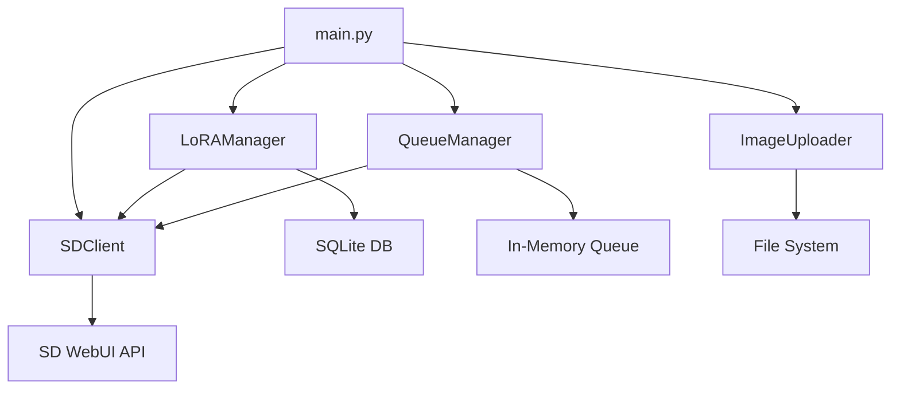

# Entry Flow & Execution Architecture

## Overview

This document traces the execution flow from MCP server startup through tool invocation, designed for experienced developers who need to quickly understand the system architecture and data flow.

## 🚀 Startup Sequence

### 1. Entry Point: `main.py`

```python
if __name__ == "__main__":
    print("[CombinedMCPServer] Starting modular MCP server...")
    mcp.run()  # FastMCP server starts
```

**Execution Path:**
```
main.py → FastMCP.run() → Async event loop → Tool registration → Client connection ready
```

### 2. Component Initialization (Lines 11-17)

```python
# Import modules
from modules.stable_diffusion import SDClient, LoRAManager, QueueManager, ImageUploader

# Initialize components (executed at module load)
sd_client = SDClient(base_url=os.getenv("SD_BASE_URL", "https://localhost:7860"))
lora_manager = LoRAManager(sd_client=sd_client)  
queue_manager = QueueManager(sd_client=sd_client)
image_uploader = ImageUploader(upload_url=os.getenv("UPLOAD_URL"))
```

**Initialization Chain:**
```
SDClient() → HTTPx async client setup
LoRAManager() → SQLite DB init → Table creation
QueueManager() → Empty job queue → Async task management  
ImageUploader() → Upload URL configuration
```

### 3. Tool Registration

**FastMCP Auto-Discovery:**
- Scans for `@mcp.tool()` decorators
- Registers 25+ tools with MCP protocol
- Creates JSON-RPC method mappings

**Tool Categories:**
- **SD Models/Samplers**: 3 tools
- **LoRA Intelligence**: 6 tools  
- **Image Generation**: 4 tools
- **Queue Management**: 4 tools
- **Image Upload**: 2 tools
- **TimeKeeping**: 3 tools
- **Orchestration**: 1 tool

## 🔄 Tool Invocation Flow

### Example: `suggest_loras_for_prompt("anime girl", 3)`

#### Phase 1: MCP Protocol Layer
```
LM Studio → JSON-RPC → FastMCP → Tool Dispatcher → suggest_loras_for_prompt()
```

#### Phase 2: Application Logic
```python
async def suggest_loras_for_prompt(prompt: str, limit: int = 5) -> str:
    try:
        suggestions = lora_manager.suggest_loras_for_prompt_smart(prompt, limit)
        return json.dumps(suggestions)
    except Exception as e:
        return json.dumps({"error": str(e)})
```

#### Phase 3: LoRA Manager Intelligence
```
suggest_loras_for_prompt_smart() 
├── SQLite query: SELECT name, category, trigger_words, metadata FROM loras
├── For each LoRA:
│   ├── Parse metadata → tag_frequency extraction
│   ├── Calculate prompt overlap score → tag matching algorithm
│   ├── Confidence scoring → high/medium/low classification
│   └── Relevance ranking → score-based sorting
└── Return top N results with scores
```

#### Phase 4: Response Path
```
Python Dict → JSON serialization → MCP Response → LM Studio
```

## 🏗️ Module Architecture

### Core Module Structure

```
modules/stable_diffusion/
├── models.py           # Pydantic data contracts
├── sd_client.py        # HTTP API abstraction  
├── lora_manager.py     # Intelligence + SQLite
├── queue_manager.py    # Async job processing
└── uploader.py         # File upload handling
```

### Data Flow Between Modules



### Dependency Injection Pattern

**Constructor Injection:**
```python
# LoRAManager receives SDClient dependency
lora_manager = LoRAManager(sd_client=sd_client)

# QueueManager receives SDClient dependency  
queue_manager = QueueManager(sd_client=sd_client)
```

**Benefits:**
- Testability (mock injection)
- Loose coupling between modules
- Configuration flexibility

## 🔍 Key Execution Patterns

### 1. Database-First Intelligence

**LoRA Analysis Flow:**
```python
# Sync phase (populates intelligence)
sync_with_sd_api() → fetch_from_api() → analyze_metadata() → store_in_sqlite()

# Query phase (serves intelligence)  
suggest_loras_for_prompt() → query_sqlite() → score_relevance() → return_ranked()
```

### 2. Async Queue Processing

**Generation Job Flow:**
```python
enqueue_generation() → create_job() → add_to_queue() → background_processor()
                                                     ↓
get_progress() ← update_status() ← execute_generation() ← process_queue()
```

### 3. Error Handling Patterns

**Current Pattern (needs abstraction):**
```python
async def tool_function():
    try:
        result = await some_operation()
        return json.dumps(result)
    except Exception as e:
        return json.dumps({"error": str(e)})
```

**Planned Abstraction:**
```python
@error_handler(fallback_response={"error": "Generation failed"})
@retry(max_attempts=3, backoff=exponential)
async def tool_function():
    # Clean business logic only
    pass
```

## 🧠 Intelligence System Deep Dive

### LoRA Metadata Analysis

**Tag Frequency Processing:**
```python
_parse_tag_frequency() → extract_ss_tag_frequency → combine_all_categories
                                                   ↓
_auto_categorize_from_tags() → pattern_matching → category_scoring
                                                 ↓  
_extract_trigger_words() → filter_generic_tags → frequency_ranking
```

**Prompt Matching Algorithm:**
```python
_calculate_prompt_tag_score():
    prompt_words = tokenize(prompt)
    total_score = 0
    
    for tag, frequency in lora_tag_frequency:
        if overlap(prompt_words, tag_words):
            weight = frequency / total_training_data
            total_score += weight
    
    return min(total_score, 1.0)
```

### Fallback Strategy

**When `ss_tag_frequency` unavailable:**
```python
if not tag_freq:
    # Fallback to filename analysis
    category, triggers, content_type, description = _analyze_from_name_and_path()
else:
    # Use training data analysis
    category = _auto_categorize_from_tags(tag_freq)
```

## 🔧 Configuration & Environment

### Environment Variable Flow

```python
# Startup
os.getenv("SD_BASE_URL", "https://localhost:7860") → SDClient.__init__()
os.getenv("IMAGE_OUT_PATH", "/tmp/images") → GenerateImageInput.output_path
os.getenv("UPLOAD_URL") → ImageUploader.__init__()
```

### MCP Configuration Integration

**mcp.json → Process Environment:**
```json
{
  "env": {
    "SD_BASE_URL": "https://localhost:7860",
    "IMAGE_OUT_PATH": "/path/to/images/"
  }
}
```

## 📊 Performance Characteristics

### Database Queries

**LoRA Summary (Fast):**
```sql
SELECT category, COUNT(*) FROM loras GROUP BY category  -- O(n) single scan
```

**Smart Search (Indexed):**
```sql
SELECT * FROM loras WHERE name LIKE ? OR trigger_words LIKE ?  -- O(log n) with indexes
```

**Prompt Analysis (Memory-Intensive):**
```python
# Loads all LoRA metadata into memory for scoring
# O(n * m) where n=LoRAs, m=average_tags_per_lora
```

### Async Patterns

**Queue Processing:**
```python
# Single background task processes queue
asyncio.create_task(self._process_queue())

# Non-blocking job status queries
queue_manager.get_job_status(job_id)  # O(1) dict lookup
```

## 🚨 Error Boundary Locations

### Current Error Handling Points

1. **HTTP API Calls** (`sd_client.py`):
   ```python
   response.raise_for_status()  # HTTPx exceptions
   ```

2. **Database Operations** (`lora_manager.py`):
   ```python
   sqlite3.connect() context managers  # SQLite exceptions
   ```

3. **JSON Processing** (everywhere):
   ```python
   json.loads() / json.dumps()  # JSON decode errors
   ```

4. **File Operations** (`uploader.py`):
   ```python
   open(), os.makedirs()  # IO exceptions
   ```

### Planned Abstraction Points

**API Client Base Class:**
```python
class BaseAPIClient:
    @retry_on_failure
    @log_requests  
    @handle_common_errors
    async def request(self, method, url, **kwargs):
        # Unified HTTP handling
```

**Database Base Class:**
```python
class BaseRepository:
    @transaction_wrapper
    @log_queries
    @handle_db_errors  
    def query(self, sql, params):
        # Unified DB handling
```

## 🔮 Future Architecture Evolution

### Planned Modularization

**Current:** Monolithic MCP (25+ tools)
```
main.py → All tools in one server
```

**Target:** Specialized MCP Servers
```
sd_mcp.py → SD-specific tools (15 tools)
time_mcp.py → Time utilities (3 tools)  
media_mcp.py → Sonarr/Radarr tools (future)
```

### Abstraction Hierarchy

**Layer 1: Protocol** (MCP/FastMCP)
**Layer 2: Framework** (Error handling, retry, auth abstractions)
**Layer 3: Domain** (SD, Time, Media modules)  
**Layer 4: Infrastructure** (HTTP, DB, File system)

---

## Quick Start for Developers

1. **Entry Point**: `main.py` - FastMCP server with component initialization
2. **Tools**: `@mcp.tool()` decorated functions returning JSON strings
3. **Intelligence**: `lora_manager.py` - SQLite-based LoRA analysis
4. **Async Processing**: `queue_manager.py` - Background job execution
5. **Configuration**: Environment variables via `os.getenv()`
6. **Testing**: `testing/` directory with module-specific test scripts

**Key Files to Understand:**
- `main.py` - Tool definitions and server startup
- `modules/stable_diffusion/lora_manager.py` - Core intelligence logic
- `modules/stable_diffusion/models.py` - Data contracts
- `README_SD_WEB.md` - API documentation